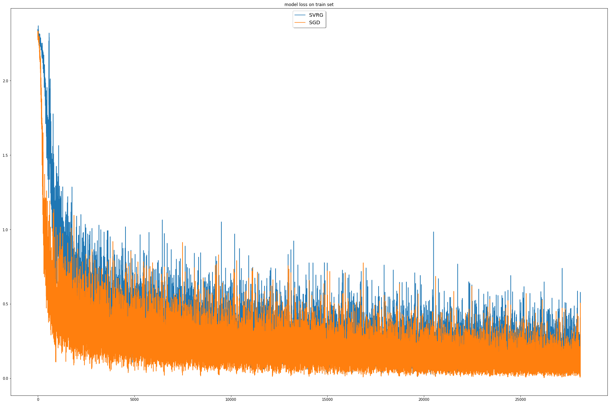

# SVRG optimizer for Keras

## Reference
https://papers.nips.cc/paper/4937-accelerating-stochastic-gradient-descent-using-predictive-variance-reduction.pdf

## Test results on MNIST
The following figure shows the train loss.

__________________________________
The results on test set:
||SVRG|SGD|
|-|----|---|
|Loss|0.0893619|0.05765046|
|Accuracy|0.9722|0.9817

